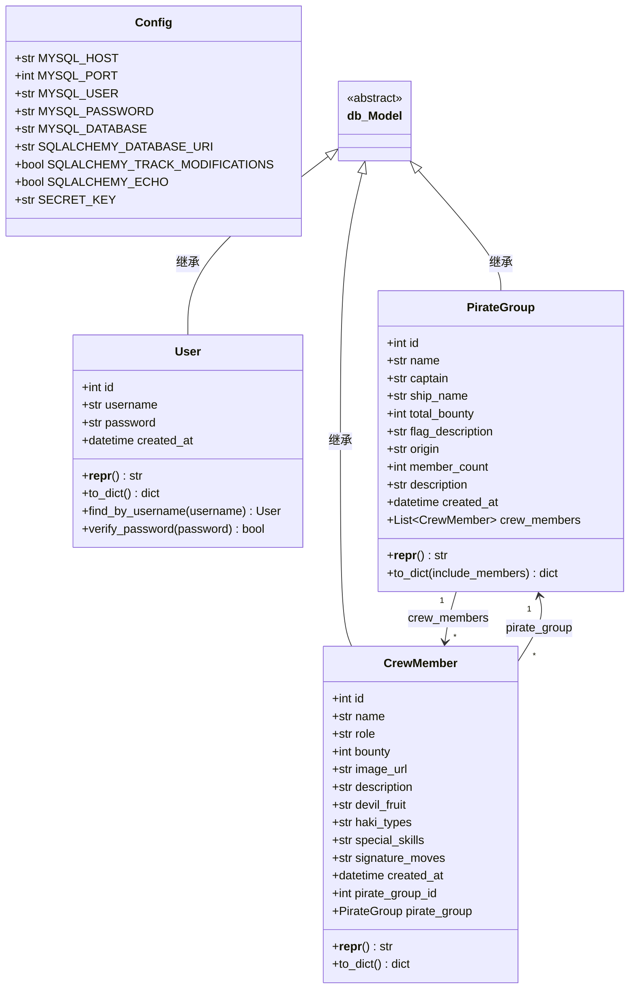
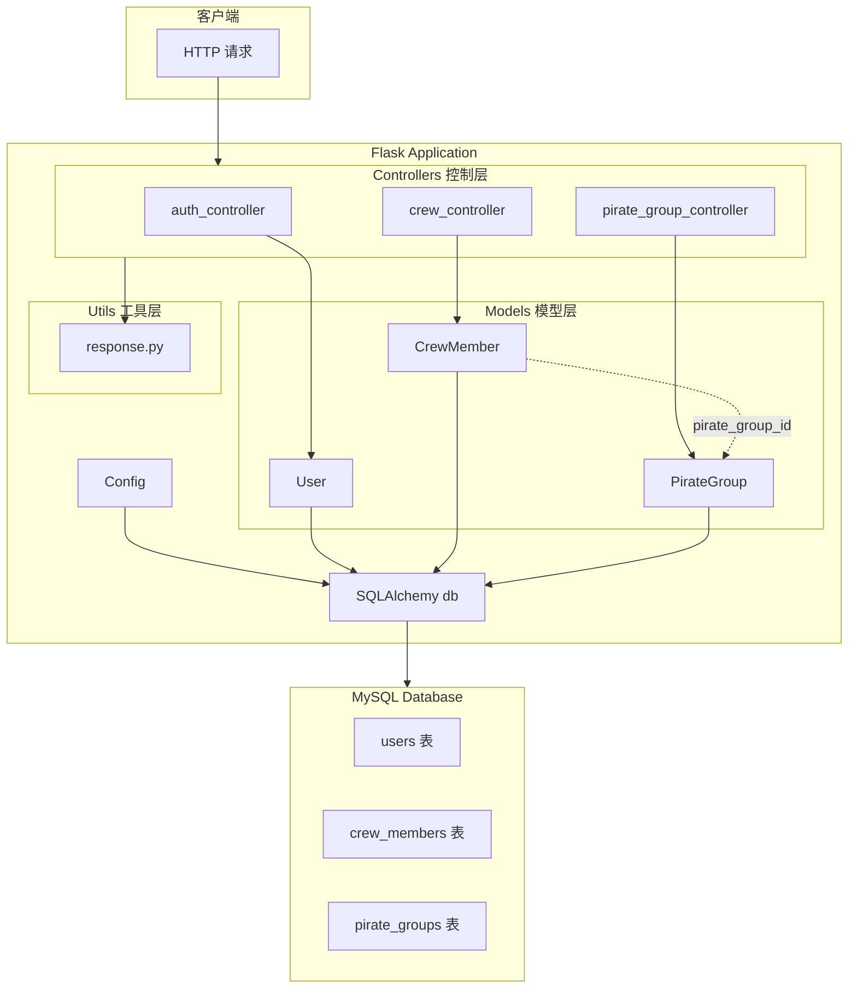
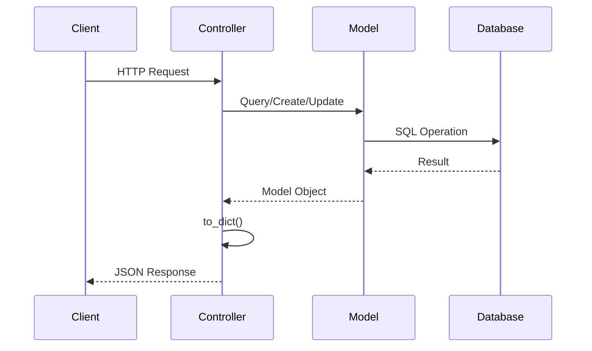

# 项目类结构分析文档

## 1. 项目概述

这是一个基于 Flask 的 Web 应用，采用 MVC 架构，使用 SQLAlchemy ORM 进行数据库操作。项目主题是"海贼王"，管理海贼团和船员信息。

## 2. 项目结构

```
onepiece/
├── __init__.py
├── app.py                    # 应用工厂
├── config.py                 # 配置类
├── models/
│   ├── __init__.py
│   ├── database.py           # 数据库初始化
│   ├── user.py               # 用户模型
│   ├── crew_member.py        # 船员模型
│   └── pirate_group.py       # 海贼团模型
├── controllers/
│   ├── __init__.py
│   ├── auth_controller.py    # 认证控制器
│   ├── crew_controller.py    # 船员控制器
│   └── pirate_group_controller.py  # 海贼团控制器
└── utils/
    ├── __init__.py
    └── response.py           # 响应工具
```

## 3. 类定义详解

### 3.1 Config 类

**文件**: `onepiece/config.py`

| 属性 | 类型 | 说明 |
|------|------|------|
| MYSQL_HOST | str | 数据库主机 |
| MYSQL_PORT | int | 数据库端口 |
| MYSQL_USER | str | 数据库用户 |
| MYSQL_PASSWORD | str | 数据库密码 |
| MYSQL_DATABASE | str | 数据库名称 |
| SQLALCHEMY_DATABASE_URI | str | SQLAlchemy 连接字符串 |
| SQLALCHEMY_TRACK_MODIFICATIONS | bool | 修改跟踪标志 |
| SQLALCHEMY_ECHO | bool | SQL 语句回显 |
| SECRET_KEY | str | JWT 密钥 |

---

### 3.2 User 类

**文件**: `onepiece/models/user.py`
**基类**: `db.Model`
**表名**: `users`

#### 属性

| 字段 | 类型 | 约束 | 说明 |
|------|------|------|------|
| id | Integer | 主键, 自增 | 用户ID |
| username | String(80) | 唯一, 非空, 索引 | 用户名 |
| password | String(256) | 非空 | 密码 |
| created_at | DateTime | 默认当前时间 | 创建时间 |

#### 方法

| 方法名 | 参数 | 返回值 | 说明 |
|--------|------|--------|------|
| `__repr__()` | - | str | 对象字符串表示 |
| `to_dict()` | - | dict | 转换为字典 |
| `find_by_username(username)` | username: str | User/None | 类方法：按用户名查找 |
| `verify_password(password)` | password: str | bool | 验证密码 |

---

### 3.3 PirateGroup 类

**文件**: `onepiece/models/pirate_group.py`
**基类**: `db.Model`
**表名**: `pirate_groups`

#### 属性

| 字段 | 类型 | 约束 | 说明 |
|------|------|------|------|
| id | Integer | 主键, 自增 | 海贼团ID |
| name | String(100) | 唯一, 非空, 索引 | 海贼团名称 |
| captain | String(100) | 可空 | 船长名字 |
| ship_name | String(100) | 可空 | 船名 |
| total_bounty | BigInteger | 默认0 | 总悬赏金 |
| flag_description | String(200) | 可空 | 旗帜描述 |
| origin | String(100) | 可空 | 起源地 |
| member_count | Integer | 默认0 | 成员数量 |
| description | Text | 可空 | 描述 |
| created_at | DateTime | 默认当前时间 | 创建时间 |

#### 关系

| 关系名 | 类型 | 目标 | 说明 |
|--------|------|------|------|
| crew_members | relationship | CrewMember | 一对多，拥有的船员列表 |

#### 方法

| 方法名 | 参数 | 返回值 | 说明 |
|--------|------|--------|------|
| `__repr__()` | - | str | 对象字符串表示 |
| `to_dict(include_members)` | include_members: bool | dict | 转换为字典，可选包含成员 |

---

### 3.4 CrewMember 类

**文件**: `onepiece/models/crew_member.py`
**基类**: `db.Model`
**表名**: `crew_members`

#### 属性

| 字段 | 类型 | 约束 | 说明 |
|------|------|------|------|
| id | Integer | 主键, 自增 | 船员ID |
| name | String(100) | 非空, 索引 | 姓名 |
| role | String(100) | 可空 | 角色 |
| bounty | BigInteger | 默认0 | 悬赏金 |
| image_url | String(500) | 可空 | 头像URL |
| description | Text | 可空 | 描述 |
| devil_fruit | String(100) | 可空 | 恶魔果实 |
| haki_types | String(200) | 可空 | 霸气类型 |
| special_skills | Text | 可空 | 特殊技能 |
| signature_moves | Text | 可空 | 招牌绝招 |
| created_at | DateTime | 默认当前时间 | 创建时间 |
| pirate_group_id | Integer | 外键 | 所属海贼团ID |

#### 关系

| 关系名 | 类型 | 目标 | 说明 |
|--------|------|------|------|
| pirate_group | backref | PirateGroup | 多对一，所属海贼团 |

#### 方法

| 方法名 | 参数 | 返回值 | 说明 |
|--------|------|--------|------|
| `__repr__()` | - | str | 对象字符串表示 |
| `to_dict()` | - | dict | 转换为字典，包含海贼团名称 |

---

## 4. 类关系

### 4.1 继承关系

```
db.Model (SQLAlchemy Base)
    ├── User
    ├── PirateGroup
    └── CrewMember
```

所有模型类都继承自 `db.Model`，这是 SQLAlchemy 的声明式基类。

### 4.2 关联关系

#### PirateGroup ←→ CrewMember (一对多)

```
PirateGroup (1) ───────────────── (N) CrewMember
                crew_members →
                ← pirate_group
```

- **PirateGroup** 通过 `crew_members` 属性访问所有船员
- **CrewMember** 通过 `pirate_group` 属性（backref）访问所属海贼团
- **外键**: `CrewMember.pirate_group_id` → `PirateGroup.id`

### 4.3 依赖关系

```
Controllers 依赖 Models:
├── auth_controller → User
├── crew_controller → CrewMember
└── pirate_group_controller → PirateGroup

Controllers 依赖 Utils:
├── auth_controller → response (success, unauthorized)
├── crew_controller → response (success, not_found, handle_exceptions)
└── pirate_group_controller → response (success, not_found, handle_exceptions)

App 依赖:
├── app.py → Config
├── app.py → db (SQLAlchemy)
└── app.py → Controllers (Blueprints)
```

---

## 5. 类图 (Mermaid)



---

## 6. 架构图 (Mermaid)



---

## 7. 数据流图



---

## 8. 总结

### 设计模式

- **MVC 架构**: Model-View-Controller 分离
- **ORM 模式**: 使用 SQLAlchemy 进行对象关系映射
- **工厂模式**: `create_app()` 应用工厂
- **装饰器模式**: `@handle_exceptions` 统一异常处理

### 关键关系

| 关系类型 | 源类 | 目标类 | 描述 |
|----------|------|--------|------|
| 继承 | User, PirateGroup, CrewMember | db.Model | ORM 基类继承 |
| 一对多 | PirateGroup | CrewMember | 海贼团拥有多个船员 |
| 多对一 | CrewMember | PirateGroup | 船员属于一个海贼团 |
| 依赖 | Controllers | Models | 控制器使用模型 |
| 依赖 | Controllers | Utils | 控制器使用工具函数 |
